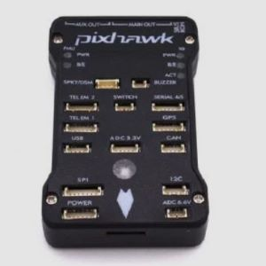
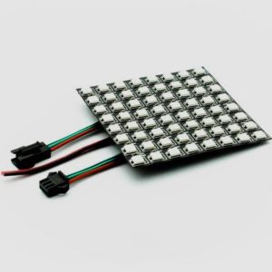
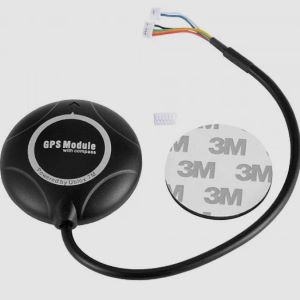

# 
<!-- Recommended dimensions for the banner: 1200x300 pixels -->

# AeroLumen Quad: A Versatile Quadcopter

### Team Members
- **Tanya Tripathi** (21BPS1595)
- **Saumitya Pareek** (21BPS1408)
- **Mohit Subramaniam** (21BPS1617)

### Supervisor
- **Dr. V. Muthumanikandan**

---

## Project Overview

AeroLumen Quad is a multi-functional quadcopter designed for versatile applications, such as aerial surveillance, environmental monitoring, and dynamic light shows. It integrates advanced flight control using the Pixhawk flight controller, wireless communication through the ESP32 microcontroller, and visual feedback via a piezo LED strip.

---

## Features
- **Advanced Flight Control**: Autonomous waypoint navigation and manual control.
- **Wireless Communication**: Real-time data transmission using the ESP32 microcontroller.
- **Dynamic Visual Effects**: Customizable lighting effects using a piezo LED strip for enhanced visibility and creative applications.
- **Versatility**: Capable of aerial surveillance, environmental monitoring, and light shows.

---

## Components
| Component                        | Image                                      | Functionality                                                                                  |
|----------------------------------|--------------------------------------------|------------------------------------------------------------------------------------------------|
| A2212 1400KV Brushless Motor     |                  | Provides thrust for stable flight.                                                              |
| 10x4.5 Propellers                |          | Generates lift for maneuvering the quadcopter.                                                  |
| Electronic Speed Controllers (ESCs)|                      | Controls motor speed for stable flight.                                                         |
| **Pixhawk Flight Controller**    |              | Manages flight control, stability, and navigation.                                              |
| **ESP32 Microcontroller**        |                  | Handles wireless communication and sensor integration.                                          |
| Piezo LED Strip                  |                | Provides lighting for signaling and visual effects.                                             |
| 3S LiPo Battery                  |              | Powers the motors and electronics.                                                              |
| GPS Module                       |                      | Enables navigation and autonomous flight.                                                       |
| Telemetry Module                 |          | Sends real-time flight data to the ground station.                                              |

*Image dimensions for components: 300x300 pixels*

---

## Assembly and Setup

### 1. **Assembly**
- 
<!-- Image dimensions: 600x400 pixels -->
- Attach the motors and propellers to the quadcopter frame.
- Mount the ESCs and connect them to the respective motors.
- Install the Pixhawk flight controller at the center of the frame.
- Integrate the ESP32 microcontroller for wireless communication.
- Attach the piezo LED strip for visual feedback.

### 2. **Calibration**
- Use mission planning software like QGroundControl for Pixhawk calibration (accelerometer, gyroscope, ESC, and compass).
- Pair the radio controller with the Pixhawk.

### 3. **Programming**
- Implement flight control logic using mission planning software.
- Program the ESP32 using Arduino IDE for communication protocols and LED control.

### 4. **Testing**
- 
<!-- Image dimensions: 600x400 pixels -->
- Conduct initial flight tests to ensure stability.
- Fine-tune PID settings for optimal performance.
- Test ESP32's wireless communication for real-time data streaming.

---

## Methodology
1. **Flight Dynamics**: Managed by the Pixhawk flight controller for stability and responsiveness.
2. **Wireless Communication**: ESP32 microcontroller transmits sensor data and receives control commands.
3. **Lighting Effects**: The piezo LED strip provides visual feedback during flights, particularly useful in low-light conditions.

---

## Unique Features
- **Integrated ESP32 for Wireless Communication**: Expands functionality with real-time data transmission and additional sensor integration.
- **Dynamic Lighting with Piezo LED Strip**: Enhances visibility and enables creative applications like light shows.
- **Advanced Flight Control**: Pixhawk supports both manual and autonomous flight, making it suitable for various missions.

---

## Applications
- **Emergency Response**: Provides aerial views and data in search and rescue missions.
- **Agriculture**: Monitors crop health and surveys large fields.
- **Security and Surveillance**: Suitable for patrolling large areas or monitoring borders.
- **Research and Data Collection**: Ideal for environmental studies and atmospheric data collection.
- **Entertainment**: Can be used in light shows and aerial displays for events.

---

## Future Enhancements
- Integration of additional sensors (e.g., thermal cameras, air quality sensors) for expanded monitoring capabilities.
- Development of a mobile application for enhanced control and real-time data visualization.

---

## How to Use
1. **Power On**: Ensure the battery is connected securely.
2. **Calibration**: Perform necessary calibrations using mission planning software.
3. **Flight**: Use the paired remote controller for manual control or pre-defined autonomous missions.
4. **Monitoring**: Observe real-time data via the telemetry module and ESP32 for wireless updates.

---

## Contributing
Contributions are welcome! If you have ideas for improvements or new features, feel free to submit a pull request or open an issue.

---

## License
This project is licensed under the MIT License - see the [LICENSE](LICENSE) file for details.

---

## Acknowledgments
- **School of Computer Science Engineering**, Cyber Physical Systems specialization.
- Special thanks to our supervisor **Dr. V. Muthumanikandan** for guidance throughout this project.

---

## Contact
For further information, please contact:
- Tanya Tripathi - [Email](mailto:email@example.com)
- Saumitya Pareek - [Email](mailto:email@example.com)
- Mohit Subramaniam - [Email](mailto:email@example.com)
